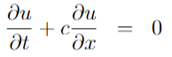
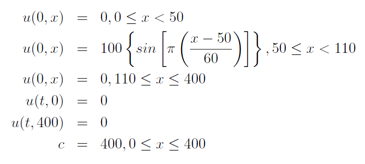
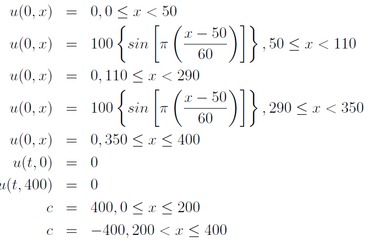

Solve the Advection equation\

using the first-order upwind method, Lax-Wendroff method, and Crank Nicolson method (using both second-order central difference and first-order backward dif-ference approximations for spatial derivative).

## Question 1
The boundary conditions are:
\
which is a move sine wave.

## Question 2
Boundary conditions:
\
which are two sine waves moving toward each other. Notice dispersive and disspative error.
